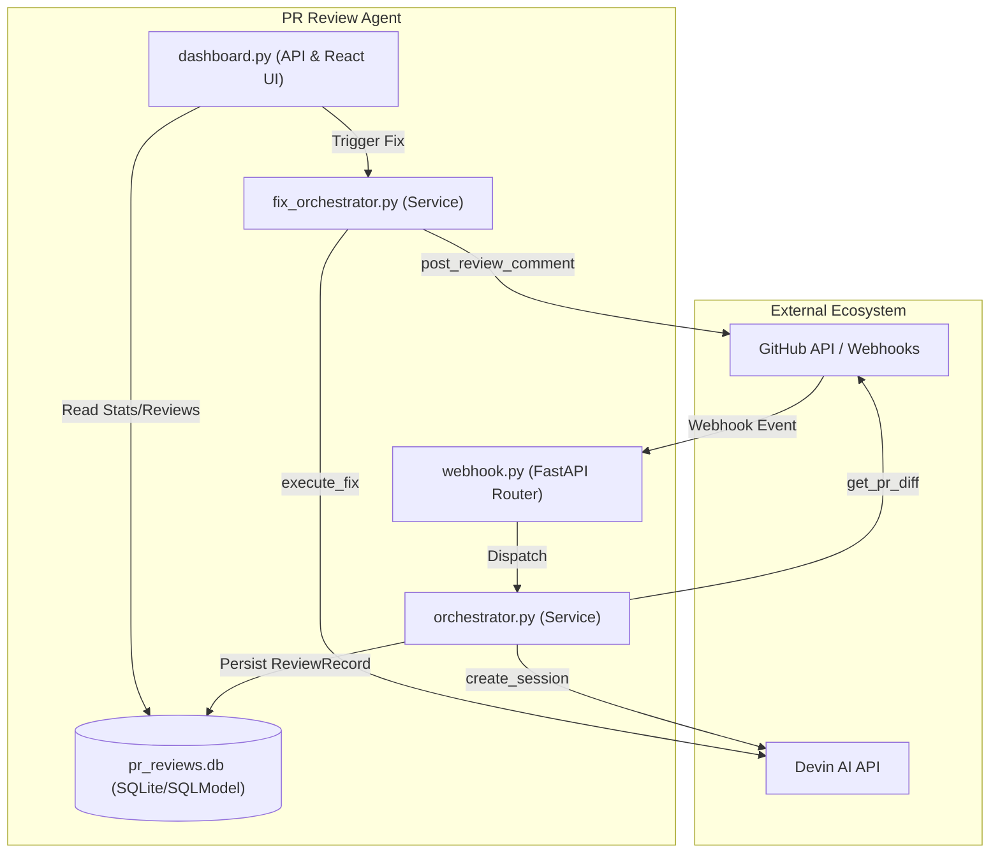

# PR Review Agent

An automated pull request analysis and remediation system. It leverages AI agents (via the Devin API) to perform multi-perspective code reviews—targeting security and code quality—and provides an interactive dashboard to review findings and trigger automated fixes.

## How It Works

The agent operates through a structured pipeline triggered by GitHub activity:

1. **Ingestion**: A `/webhook/github` endpoint receives a `pull_request` event and validates the payload using HMAC-SHA256 signatures.
2. **Orchestration**: The system fetches the PR diff and dispatches parallel Devin sessions — one for **Security** and one for **Quality**.
3. **Synthesis**: A third AI session synthesizes the individual reports into a unified set of findings, persisted to SQLite.
4. **Reporting**: Findings are posted back to the GitHub PR as a summary comment and surfaced in the local React dashboard.
5. **Remediation**: Users can trigger "Fix Actions" from the dashboard, spawning a Devin session to generate and commit code fixes directly to the branch.



## Tech Stack

| Layer | Technology | Role |
| :--- | :--- | :--- |
| **Backend** | Python 3.12+, FastAPI | API framework and request routing |
| **Database** | SQLite + SQLModel | Async persistence of review records and findings |
| **Frontend** | React + Vite | Dashboard for visualizing PR metrics and managing fixes |
| **AI Engine** | Devin API | Autonomous agent execution for analysis and coding tasks |
| **Integration** | GitHub REST API | Source code retrieval and PR commenting |

## Getting Started

### Prerequisites

- Python 3.12+
- Node.js 20+ (for frontend)
- SQLite

### Environment Configuration

Copy `.env.example` to `.env` and populate the following variables:

| Variable | Description | Default |
| :--- | :--- | :--- |
| `DEVIN_API_KEY` | Bearer token for authenticating with the Devin API | `""` |
| `GITHUB_TOKEN` | Personal Access Token for reading PR diffs and posting comments | `""` |
| `GITHUB_WEBHOOK_SECRET` | Secret key for verifying HMAC-SHA256 signatures from GitHub | `""` |
| `DATABASE_URL` | SQLAlchemy connection string for the SQLite database | `sqlite+aiosqlite:///./data/pr_reviews.db` |

### Local Development

**Backend:**
```bash
python -m venv .venv && source .venv/bin/activate
pip install -r requirements.txt
cp .env.example .env   # then fill in secrets
mkdir -p data
uvicorn app.main:app --reload
```

**Frontend:**
```bash
cd frontend
npm install
npm run build
```

### Docker

The project ships a multi-stage `Dockerfile` that builds the React frontend and packages it with the FastAPI backend into a single image.

```bash
docker compose up --build
```

- The app is available at `http://localhost:8000`.
- The SQLite database is persisted via the `dbdata` named volume.

## Running Tests

```bash
pytest
```

Test coverage includes webhook signature verification, review orchestration, and fix workflow state transitions.
